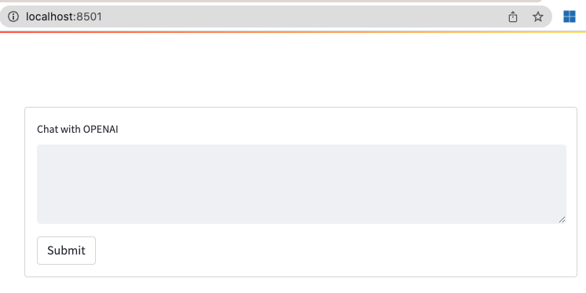

# BuildJapan_2023

## Overview
This repository aimes at demonstrating features of [Prompt flow](https://techcommunity.microsoft.com/t5/ai-machine-learning-blog/harness-the-power-of-large-language-models-with-azure-machine/ba-p/3828459) and [Azure Open AI](https://learn.microsoft.com/en-us/azure/cognitive-services/openai/overview).


## How to use

1. Install required libraries in python:
    ```sh
    pip install -r ./requirements.txt
    ```
2. Provision Azure resouces
    - This repository uses Azure Open AI for chatGPT, and prompt flow resource in Azure ML.

3. Configure
    - Please populate the following contents with `config.yml`. You can change the parameter whatever you want, and you need to change the values for `[YOUR_INSTANCE]` or others.
        ```config.yml
        OPENAI:
            basic_config:
                api_type: 'azure'
                api_key: '[YOUR_API_KEY]'
                api_base: 'https://[YOUR_INSTANCE].openai.azure.com/'
                api_version: '2023-03-15-preview'
            engine: 'demo-openai'
            params: 
                temperature: 0.9
                max_tokens: 150
                top_p: 1
                frequency_penalty: 0.0
                presence_penalty: 0.6
                stop: None

        PROMPT_FLOW:
            url: 'https://[YOUR_INSTANCE].japaneast.inference.ml.azure.com/score'
            api_key: '[YOUR_KEY]'
        ```
    - `OPENAI` 
        - Please specify appropriate parameters by yourself. You can find the explanation in the portal as below.
         
        - By clicking `View code` in the upper middle button, you get the following sample code in `python`. Fill in your `Endpoint` and `api_key` in your code.
         
    - `PROMPT FLOW`
        - You find API key and endpoint, after you complete the deployment in prompt flow. Please fill these values in the configuration file.
        - 

4. Run!
    - Run in command:
        ```sh
        streamlit run ./app.py 
        ```
        You fill find the following prompt, if you succeed in the run.
        
    - Streamlit automatically open the site, otherwise please access the site as follows: 
         

        <video width="320" height="240" controls>
        <source src="./docs/movie.mov" type="video/mp4">
        </video>